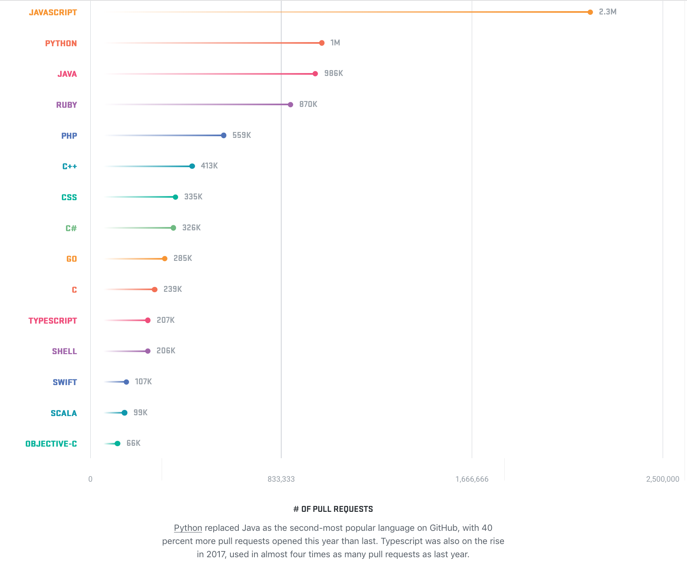

---
title:
- Python for Data Science
author:
- Matthew Cooper Healy mhealy@mst.edu
---

# Python
Python was conceived in the late 1980s, and its implementation began in December
1989 by Guido van Rossum at Centrum Wiskunde & Informatica (CWI) in the
Netherlands as a successor to the ABC language (itself inspired by SETL) capable
of exception handling and interfacing with the Amoeba operating system.

# Why Python?
 - Open Source
 - Amazing Community
 - Short Learning Curve
 - General Purpose Language

# Open Source
> Python is developed under an OSI-approved open source license,
> making it freely usable and distributable, even for commercial use.
>    -python.org

>The mission of the Python Software Foundation is to promote, protect, and advance
>the Python programming language, and to support and facilitate the growth of a
>diverse and international community of Python programmers.
>    —from the Mission Statement page

[Source Code](https://goo.gl/AD6UDG)

# Community

# Short Learning Curve
##[Learn Python in One Video](https://youtu.be/N4mEzFDjqtA)
##[Basic Python](https://docs.python.org/3/tutorial/)

# General Purpose Language
Python is intended to be used as a language for any sort of project.
Its design is meant to streamline coding by providing *one* way to do something
correctly. this reduces ambiguity, and allows for larger and more complex
projects to be maintainable.

Because of its simple, readable style, Python has taken the world by storm,
leading to some pretty interesting projects.

[Examples](http://usingpython.com/programs/)

# Libraries for Data Science
 - [Numpy](http://numpy.org)
 - [Pandas](http::/pandas.pydata.org)
 - [Matplotlib](http://matplotlib.org)
 - [Seaborn](http://seaborn.org)
 - [Scikit-Learn](http://scikit-learn.org)

# Examples
## [Jupyter Notebooks](http://try.jupyter.org/)
## [Loading Data](https://goo.gl/EFQKHH)
## [Doing Analysis](https://goo.gl/7D7MYH)
## [Visualization](https://goo.gl/mkLE5a)
## [Complete Tutorial](https://goo.gl/swZf7e)

# Shortcomings(vs R)
 - Less helpful visualization suites
 - Smaller statistical community
 - Less focused on data science

[**Infographic**](https://goo.gl/5zBoud)

# Conclusion
Python is an excellent language for rapid testing and prototyping.
However, your tools should suit what *you* want to do with them, so it
may/may not be right for *you*.

### **TL;DR:** Give it a try, see what you think!
